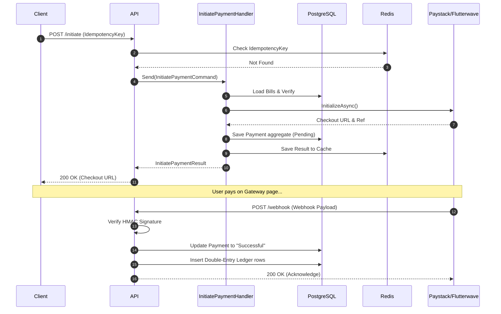

# RevPay Nigeria — System Architecture & Data Flow

This document provides a comprehensive breakdown of how the RevPay backend works, its architectural decisions, core workflows, and integration points. This is intended to give a developer or technical stakeholder a complete mental model of the system.

## 1. Architectural Foundation

RevPay is built on **.NET 9**, implementing **Clean Architecture** and **CQRS (Command-Query Responsibility Segregation)**.

### Clean Architecture Layers
The project is strictly divided into four concentric circles of dependency:

1. **Domain (`RevPay.Domain`)**: 
   - *No external dependencies.*
   - Contains Enterprise Business Rules (Entities, Value Objects, Enums, Domain Events).
   - E.g., `Payment.cs` holds logic ensuring you cannot pay a cancelled bill.
   
2. **Application (`RevPay.Application`)**:
   - *Depends only on Domain.*
   - Defines Application Business Rules (Use Cases). 
   - Uses MediatR for handling Commands (writes) and Queries (reads).
   - Contains interfaces for external concerns (e.g., `IPaymentGateway`, `IBillRepository`), following the Dependency Inversion principle.
   
3. **Infrastructure (`RevPay.Infrastructure`)**:
   - *Depends on Application and Domain.*
   - Implements the interfaces defined in Application. 
   - EF Core for PostgreSQL (`AppDbContext`), Redis caching (`IdempotencyService`), HTTP clients for Paystack/Flutterwave, and Hangfire job scheduling.
   
4. **API (`RevPay.API`)**:
   - *Depends on Application and Infrastructure.*
   - The presentation layer. Contains ASP.NET Core Controllers, Swagger, Rate Limiting, Exception Handling middlewares, and Dependency Injection bootstrapping.

---

## 2. Core Workflows

### A. The Payment Lifecycle
This is the most critical flow in the system. It uses **Idempotency** to guarantee safe retries over unstable mobile networks.

1. **Initiate Payment**
   - **User Action**: Taxpayer selects bills to pay in the mobile app/portal.
   - **Request**: Client calls `POST /api/v1/payments/initiate` passing `BillIds` and an `Idempotency-Key` header.
   - **Command Handler**: `InitiatePaymentHandler` kicks in.
   - **Idempotency Check**: Redis is checked. If the key exists, return the cached result instantly (Step 1 of resilience).
   - **Validation**: System checks if the bills exist, belong to the user, and aren't already paid.
   - **Gateway Call**: The system uses a factory (`IPaymentGatewayFactory`) to pick the right processor (e.g., Paystack) and initializes via an HTTP call to the gateway API.
   - **State Saved**: A `Payment` aggregate is saved to PostgreSQL in a `Pending` state.
   - **Response**: The gateway's checkout URL is returned to the user, and the response is cached in Redis for 24h.

2. **Verify Payment (Webhook)**
   - **Callback**: After the user types their card details, Paystack asynchronously posts a webhook to `POST /api/v1/payments/webhook/paystack`.
   - **Security**: The payload signature is computationally verified using `HMAC-SHA512` to guarantee it actually came from Paystack.
   - **Verify Command**: `VerifyPaymentHandler` is dispatched.
   - **Confirmation**: The backend calls the Gateway API verify endpoint to double-check the transaction.
   - **State Mutation**: The `Payment` is marked as `Successful`, and all associated `Bill`s are marked as `Paid`.
   - **Ledger Entries**: `LedgerService` runs, debiting the clearing account and crediting the specific MDA Revenue accounts (Double-entry accounting).
   - **Domain Events Fired**: A `PaymentCompletedEvent` is fired internally.
   - **Post-Payment Triggers**: `PaymentCompletedEventHandler` listens to this event, generates a PDF receipt, and triggers Email/SMS alerts to the taxpayer via Hangfire.

### B. Authentication Flow
- **Registration**: Custom `User` entity is created alongside a `Taxpayer` domain entity. Passwords are hashed using `BCrypt`.
- **Login**: `LoginHandler` verifies BCrypt hashes and returns two tokens:
   1. A short-lived **JWT Access Token** (for stateless API auth).
   2. A long-lived **Refresh Token** (hashed and stored in PostgreSQL) for seamless background session refreshes without requiring the user to type their password again.

### C. Daily Reconciliation
- **Job Trigger**: Hangfire runs `ReconciliationJob` every day at 2:00 AM.
- **Action**: It queries all `Successful` payments in PostgreSQL for the previous day, grouped by Gateway (Paystack, Interswitch, etc).
- **Comparison**: It fetches the gateway settlement reports via API (e.g. how much Paystack says they paid us).
- **Variance Check**: Computes the difference. If the variance is > ₦100, an SMS/Email alert is fired to the State Finance Ministry for manual investigation.

---

## 3. Resilience & Security Mechanisms

| Mechanism | Technology | Description |
|-----------|-----------|-------------|
| **Idempotency** | Redis | Front-door protection. The `IdempotencyMiddleware` combined with Application logic ensures the exact same request body/headers aren't processed twice within 24 hours. |
| **Circuit Breakers & Retries** | Polly | Applied to all outbound `HttpClient` requests to Gateways. If Paystack is down, the system retries exponentially. If failing continuously, the circuit trips to protect system threads. |
| **Webhook Signatures** | System.Security.Cryptography | Hardened webhook ingestion using fixed-time equality comparisons of HMAC hashes to prevent timing side-channel attacks and fake payment spoofing. |
| **Password Security** | BCrypt.Net | Passwords and Refresh Tokens are never stored in plaintext, but fully hashed with salting and work factor delays to defeat rainbow table attacks. |
| **API Abuse Prevention** | RateLimiter | `AspNetCoreRateLimit` is configured to restrict IP buckets to 100 requests per minute, preventing DoS attacks and brute-forcing. |

---

## 4. Key Request/Response Flow (Sequence)

